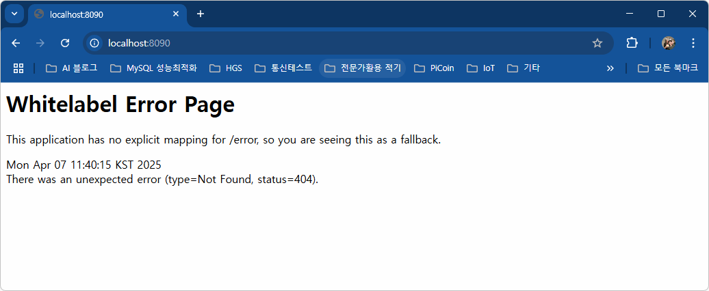
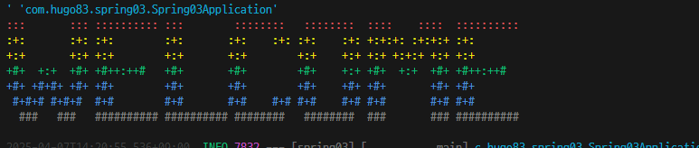
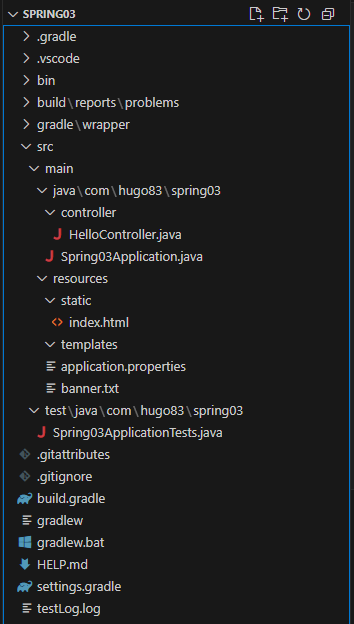

# java_springboot_2025
2025년 Java 개발자 과정 SpringBoot repository

## 1일차(04/01)

### Web 개요
- 구성 3단계
    - 브라우저(클라이언트/프론트엔드): 사용자 **요청**을 하고, 결과를 돌려받는 파트
    - 서버: 사용자의 요청 -> DB에서 데이터를 가져와 처리 즉, 사용자에게 **응답**하는 파트
    - 데이터베이스: 가장 중요한 데이터가 저장되어 있는 파트

- **Web 개념**
    - Request(요청)에 대한 Response(응답)

### Spring Boot 개요
- Java: 컴퓨터 세상 모든 곳에서 사용될 수 있는 언어가 되고자 개발됨
- Java Web 개발
    1. CGI(Common GateWay Interface): HTTP 프로토골에서 정적인 데이터만 전달할 수 있는 Web 기술
    2. Servlet: CGI를 개선한 Java Web 기술, 동적 Web을 개발할 수 있음
        - HTML 코드를 전부 다 Java에서 작성해야 함
    3. EJB(Enterprise Java Bean): 서블릿으로 대형 프로젝트를 개발할 수 있는 Java Web 기술
        - 복잡함
    4. JSP(Java Server Pages): 웹페이지코드(HTML)에 자바 소스를 포함시켜서 개발할 수 있는 Java Web 기술
        - 확장자가 .jsp / 스파게티 코드
    5. Spring: Java Web 개발 전성기
        - 설정이 복잡
    6. Spring Boot: Spring의 단점을 최소화하고 설정을 간결화

- Spring Boot
    - Spring 기술을 그대로 사용(마이그레이션이 간단단)
    - JPA 기술을 사용하면 ERD나 DB 설계를 하지 않고도 손쉽게 DB를 생성, DB연동도 쉬움
    - Tomcat Webserver가 내장(설치 필요없음)
    - 서포트하는 기능 다수 존재(개발을 쉽게 도와줌)
    - Test용 JUnit, 로그용 Log4J2 모두 포함(설치 필요없음)
    - 프론트엔드를 다양하게 지원. JSP, **Thymeleaf**, Mustache 등
    - MVC로 영역을 분리 각 부분별로 따로 개발

- MVC
    - View는 JSP포함, Thymeleaf, Mustach, HTML 등등
    

### Spring Boot 개발환경 설정
- 필요 요소
    - Java, 개발 tool, DataBase

- Java
    - Java Runtime과 JDK(Java Developer Kit)존재
        - Oracle외에도 OpenJDK가 산재
            -  https://jdk.java.net/
            -  https://adoptium.net/
            -  https://www.azul.com/downloads/?package=jdk#zulu
    - Java 17버전 이상 설치, jdk-17.0.13_windows-x64_bin.msi 다운로드

    - 시스템 정보(sysdm.cpl)에서 PATH 설정
        - JAVA_HOME 새로 만들기 -> 본인 경로로
        - path에 %JAVA_HOME%\bin 추가, 맨 위로
    - powershell
        - java --version 확인

- Visual Studio Code 확장 설치
    - Java 검색
        - Extension Pack for Java

### Java 기본 실행
- VS Code에서 명령 팔레트 실행(Ctrl + Shift + P)
    - Java create
        1. Build tool > Maven
        2. No ArchType 선택
        3. Group ID 입력(com.example)
        4. Artifact ID 입력(demo)
        5. 저장 위치 결정

### Spring Boot 설정
- Visual Studio Code 확장 설치
    - Spring 검색
        - Spring Boot Extension Pack 설치 
            - Spring Initiaizr Java Support
            - Spring Boot Dashboard
    - Gradle(빌드툴) 검색
        - Gradle for Java 설치

### Spring Boot 기본 실행(Java 프로젝트)
- JDK 버전과 Spring Boot Initializr에 선택하는 JDK 버전이 일치해야 함
    - OS에 JDK 버전이 17버전이면 17 선택
- VS Code에서 명령 팔레트 실행
    - Spring Initializr: Create a Maven Project
    - Specify Spring Boot version: 3.3.10 선택
    - Specify project language: Java
    - Input Group Id: 본인 아이디 입력/com.jsz
    - Input Artifact Id: Spring01
    - Specify packaging type: Jar(Java archive, 압축파일)
    - Specify Java version: 17
    - Choose dependencies: Selected 0 dependencies 
    - 저장 위치 선택
    - 새 창 열기 - Spring Boot 프로젝트가 루트 폴더가 된 개발 환경

- 실행 방법
    - 코드 작성
    - Spring Boot Dashboard > Apps > 앱 실행

- 기초 문법
    - [JAVA 기초문법](./JAVA_BASIC.md)

## 2일차
- 기초 문법 계속
     - [JAVA 기초문법](./JAVA_BASIC.md)
     - 흐름제어(반복문), 배열, 메서드, 객체/클래스, 상속

## 3일차
- 기초 문법 계속
    - [JAVA 기초문법](./JAVA_BASIC.md)
    - 상속, 인터페이스, 예외처리, 제네릭, 컬렉션 프레임워크, 입출력

### Spring Boot Build Tool
- 개요
    - 프로젝트 빌드 과정을 자동화시켜주는 도구
    - 컴파일, 테스트, 패키징, 의존성 관리, 배포 등등 포함

- Maven
    1. Java 프로젝트 기본 빌드도구
    2. Maven Repository, Log4j2
    3. 빌드, 패키징(Jar/War 파일 생성), 테스트 등을 한 번의 명령으로 간편하게 처리
    4. 가장 큰 특징이 오부 라이브러리 자동으로 다운로드, 관리
    5. pom.xml(Project Object Model)파일로 빌드 설정 관리
        - 초기 설정시 빠졌거나, 추가되어야 하면 xml 코딩으로 추가

- Gradle
    - 안드로이드용 오픈소스 빌드도구
    - Maven Repository를 같이 사용, https://mvnrepository.com/
    - Maven의 3, 4번 특징을 그대로 가지고 있음
    - build.gradle 파일 사용, Groovy 스크립트 지원
    - 빌드과정을 병렬처리, 캐싱사용으로 Maven보다 10~100재 향상된 성능
    
### Gradle 설정
- Gradle로 프로젝트가 제대로 동작하지 않으면
    - https://gradle.org/ 에서 gradle 다운로드
    - 설치 경로 확인, 설치
    - 시스템 등록정보 PATH 지정, GRADLE_HOME 사용

### Spring Boot 로그 설정
- Spring Boot를 colorizing 해주는 기능
- src/resourcces/application.properties

    ```shell
    spring.output.ansi.enabled=always
    ```

## 4일차
- 기초문법 마무리
    - [Java기초문법](./JAVA_BASIC.md)
    - 제네릭, 컬렉션 프레임워크

- Spring Boot 시작

## 5일차

### Spring Boot 웹실행
- 프로젝트 초기화
    - Spring Initializr: Create a Gradel Project
    - Specify Spring Boot version: 3.4.4
    - Specify project language: Java
    - Input Group Id: 본인 아이디 입력/com.jsz
    - Input Artifact Id: Spring01
    - Specify packaging type: Jar(Java archive, 압축파일)
    - Specify Java version: 17
    - Choose dependencies: Selected 1 dependencies 
        - Spring Web
    - 저장 위치 선택
    - 새 창 열기 - Spring Boot 프로젝트가 루트 폴더가 된 개발 환경

- 기본 성정
    - application.properties에 `spring.output.ansi.enabled=always` 추가

- 포트 번호
    |프로토콜|포트번호|비고|
    |:---|---:|:---|
    |HTTP|80|웹 서비스 포트(보안 취약)|
    |HTTPS|443|SSL을 적용한 웹 서비스(보안 강화)|
    |FTP|21|웹을 통한 파일전송|
    |TELNET|23|원격서버접속 서비스|
    |SSH|22|보안 강화된 텔넷|
    |SMTP|25|메일 전송 서비스|

- 개발용 포트
    - 포트는 중복 안 됨
    - 8080 포트를 사용하고 있으면 다른 포트로 변경해야 함
    - 포트 변경시 application.properties에 `server.port=8090` 추가

- 웹 브라우저 열기
    - http://localhost:8090/ 오픈

    

- 접속 위치 요청 처리
    - 컨트롤러 생성
        - HelloController 클래스 생성
        - http://localhost:8090/hello

    - 각 기능별로 패키지를 구분
        - controller, model 등...

### 로그 출력
- Log-back
    - 스프링부트에 내장된 로그 모듈
    - application.properties 내 로그 설정

    ```groovy
    logging.level.root = info
    logging.file.name = /logtest.log
    ```

    - 사용 시
    ```java
    // 클래스 내 작성
     private final Logger logger = LoggerFactory.getLogger(this.getClass());

    // 메서드 내 사용
    logger.info("hello URL 오픈"); 
    
    // 문제 발생 시 로그
    logger.debug("디버그 시 필요한 로그입니다.");
    logger.trace("디버그 시 필요한 로그입니다.");

    logger.warn("경고 표시시 나타내는 로그입니다.");
    logger.error("오류 표시시 나타내는 로그입니다.");
    ```

### 스프링부트 배너(중요도 없음)
- resources 폴더에 banner.txt 생성
- 내용 추가
- [Spring Boot Banner Generator](https://devops.datenkollektiv.de/banner.txt/index.html)
- 배너제너레이터로 생성한 글자 복사 banner.txt 붙여넣기
- 서버 재시작



### 메인페이지 추가
- resources/static/index.html부터 시작

### 스프링부트 프로젝트 구조


- 각 폴더 구조
    - .gradle ~ build: Gradle, VSCode, 빌드 등에 필요한 폴더(설명 필요 없음)
    - src/main/java: 패키지와 자바 소스가 저장되는 위치
    - com.jsz.spring03: 패키지, 폴더로 구성
        - HelloController 클래스에 접근하려면
        - com.jsz.spring03.controller.HelloController 접근
    - Spring03Application.java: 시작프로그램
    - src/main/resources: 자바 파일 이외 HTML, CSS, JS, 환경파일 등 리소스 파일 저장되는 위치
        - static: CSS, JS, 이미지 파일 저장되는 곳
        - templates: 스프링부트와 연계되는 HTML 파일이 저장되는 곳
        - application.properties: 프로젝트 환경설정 파일. 환경변수, DB 설정
    - src/test/java: JUnit 스프링부트 테스트도구 자바 파일 저장되는 위치
    - build.gradle: gradle 환경 파일, Groovy 기반으로 한 빌드 도구. dependencies만 잘 구성하면 됨
    - gradlew.bat: 중간에 직접 그레이들 빌드를 할 때 사용하는 배치파일
    - settings.gradle: 고급 그레이들 설정. 손댈 일은 없음

### 스프링부트 어노테이션

#### @SpringBootApplication
- 스프링부트 자동구성 매커니즘 활성화
- 어플리케이션 내 패키지에서 컴포넌트들 스캐닝
- 설정 클래스 임포트해서 활성화, 스프링부트 실행

#### @Controller
- 컴포넌트 구체화해서 해당 클래스 IoC 컨테이너 Bean으로 등록

#### @GetMapping
- Get, Post 중 Get(URL)으로 들어오는 주소를 매핑, 처리해주는 역할
- @PostMapping, @RequestMapping 등 파악

#### @ResponseBody
- HTTP 요청의 자바객체가 처리한 body내용을 매핑하는 역할
- 자바의 String 문자열을 웹페이지에 렌더링.


## 6일차(06-26)